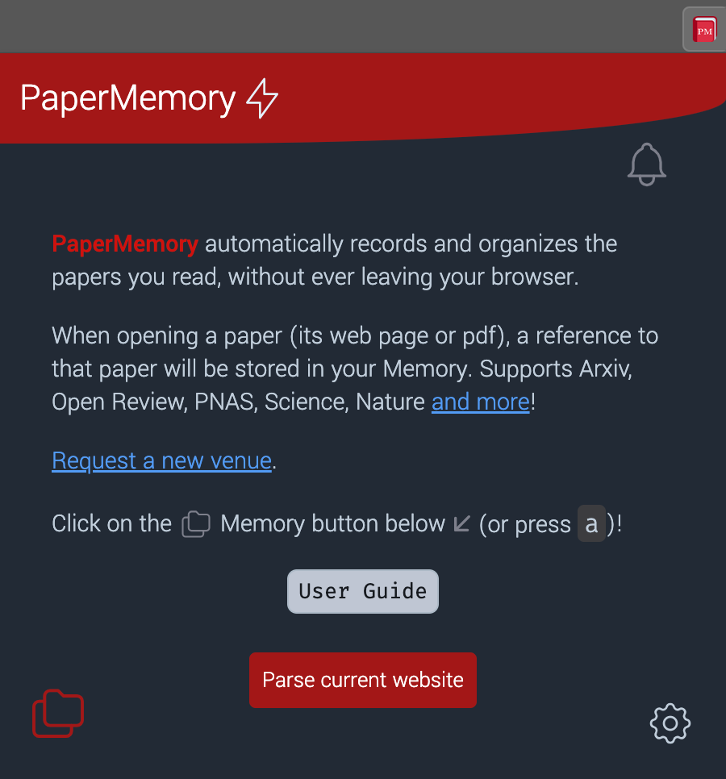
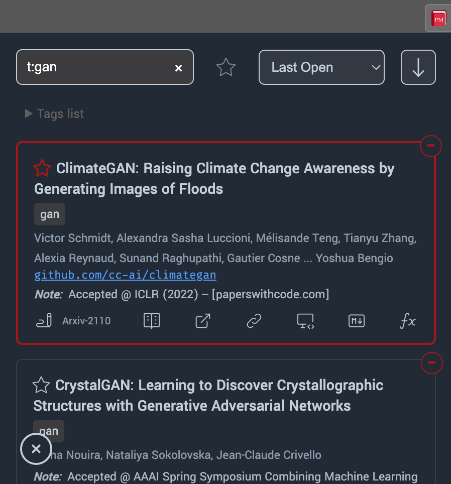
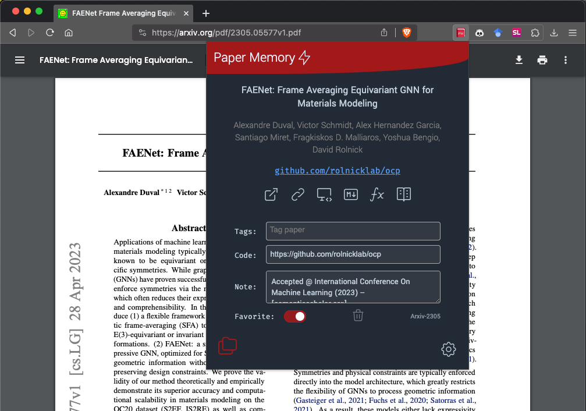

# Getting Started

## Installation

{ align=right .demo-gif }

### Browser Stores

 
 

[:fontawesome-brands-chrome: Chrome / :simple-brave: Brave / :fontawesome-brands-edge: Edge](https://chromewebstore.google.com/detail/paper-memory/hmebhknlgddhfbbdhgplnillngljgmdi?pli=1){ .md-button .md-button--primary }

 

  [:fontawesome-brands-firefox-browser: Firefox](https://addons.mozilla.org/en-US/firefox/addon/paper-memory/){ .md-button .md-button--primary }

 

### From source

=== "Chrome / Brave / Edge"

    * Clone the repo
    * Go to Chrome/Brave's extension manager `chrome://extensions/`
    * Enable developer mode (top right)
    * Click on the "Load unpackaged extension" button
    * Select the downloaded folder

=== "Firefox"

    * Clone the repo
    * Go to `about:debugging#/runtime/this-firefox` in the address bar
    * Click on "Load Temporary Add-on"
    * Select the `manifest.json` file in the `PaperMemory/` folder
    * __NB__ this is a temporary install you may have to re-do this loading operation if you close Firefox

!!! tip

    For better usability, I recommend that you *pin* the PaperMemory extension to your browser's toolbar.

## Main components

### Popup

{ align=right .popup-display }

Your main interface to PaperMemory is its popup. You can open it by clicking on the PaperMemory extension icon or using the default keyboard shortcut:

* ++cmd+shift+"E"++ (:fontawesome-brands-apple:)
* ++ctrl+shift+"M"++ (:fontawesome-brands-windows: / :fontawesome-brands-linux:)

!!! tip "User Guide"

    The `User Guide` also contains a recap of keyboard shortcuts and search syntax.

!!! info "Keyboard Shortcuts"

    You can customize keyboard shortcuts (or verify that they work), see [Configuration](configuration.md#keyboard-shortcuts)

---

### Popup Menu

{ align=left .popup-display }

By clicking on the popup bottom-right :octicons-gear-16: symbol, you can open the customization menu.

The detail list of available customization options can be found in [Configuration](./configuration.md#popup-menu).

---

### Memory

{ align=right .popup-display }

Open your Memory (*i.e.* the list of your papers) by clicking on the popup bottom-left :material-folder-multiple-outline:{ color="red" } button.

In the search bar, you can search by title or author, prefix by `t:` to search for tags or by `y:` to search by year. More information in [Searching for papers](features.md#searching).

You can also

* :tabler-star: Mark a paper as Favourite
* :tabler-writing: Edit the paper's tags, code link and note
* :tabler-vocabulary: open a downloaded PDF
* :tabler-external-link: Go to the paper's online page (1)
* :octicons-link-24: Copy the link to the paper (2)
* :tabler-device-desktop-code: Copy a formatted hyperlink (for emails for instance)
* :material-language-markdown-outline: Copy a `[$title]($url)` Markdown-formatted link (3)
* :tabler-math-function: Copy a BibTex entry for your `.bib` bibliography.

1.  This will lead you to the paper's PDF or Abstract, depending on your settings in the Popup Menu.
2.  This will copy the paper's PDF or Abstract, depending on your settings in the Popup Menu.
3.  The URL used will be the paper's PDF or Abstract, depending on your settings in the Popup Menu.

---

### Paper page

{ align=left .advanced-screenshot }

When on a known article's page, PaperMemory will display its meta-data (title, authors, code link), similar actions as in the memory (:tabler-writing:, :tabler-vocabulary:, :tabler-external-link:, :octicons-link-24:, :tabler-device-desktop-code:, :material-language-markdown-outline:, :tabler-math-function:) and customization options.

---

### BibMatcher

{ align=right .advanced-screenshot }

Update your `.bib` file with actual published references.

At the bottom of the Popup Menu, click on the *PaperMemory BibMatcher* link to open a tool that allows you to seamlessly match Arxiv references in your `.bib` file to actual publications, using the PaperMemory's [preprint matching feature](features.md#preprint-matching).

---

### Advanced Options

{ align=left .advanced-screenshot }

More customization options and features are available in the advanced options page:

* Right click on the extension's button in your browser toolbar and select *Options*
* Open the Popup Menu, scroll down and click on *Options page*.

More details in [Configuration](configuration.md#advanced-options).

